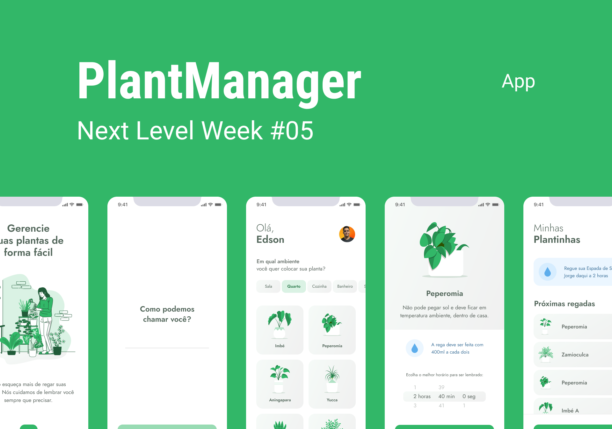

<div align="center">
  

  
</div>

  # 🗂️ Topics
   * <a href="#About"> About</a>
   * <a href="#Layout"> Layout</a>
   * <a href="#Features"> Features</a>
   * <a href="#How-to-use"> How to use</a>
      * <a href="#Prerequisites"> Prerequisites</a>
      * <a href="#Running-the-app"> Running the app</a>
      * <a href="#Running-the-server"> Running the server</a>
   * <a href="#Technologies"> Technologies</a>
   * <a href="#License"> License</a>
   * <a href="#Author"> Author</a>

  <h1 id="About">🌱About</h1>
  <p>Application created to manage your plants in an easy way. </p>
  <p>We help you never forget to water and take care of your plates.</p>

  <h1 id="Layout">💅🏻Layout</h1>
  

  <h1 id="Features">📌Features</h1>
  <input id="check-one" type="checkbox" checked/>
  <label for="check-one">User name registration.</label>
  <br />
  <input id="check-two" type="checkbox" checked/>
  <label for="check-two">Option to choose the plant you want.</label>
  <br />
  <input id="check-three" type="checkbox" checked/>
  <label for="check-three">Register the plant you want and the time you want to be reminded to water it.</label>
  <br />
  <input id="check-four" type="checkbox" checked/>
  <label for="check-four">See the plants registered in your account.</label>
  <br />
  <input id="check-five" type="checkbox" checked/>
  <label for="check-five">Delete any plant you want from your profile.</label>
  <br />
  <input id="check-six" type="checkbox" checked/>
  <label for="check-six">Receive notification when a plant is in the watering time.</label>

  <h1 id="How-to-use">🤓How to use</h1>

  <h3 id="Prerequisites">Prerequisites</h3>

  <p>To be able to use the application, you need the following tools: </p>
  <a href="https://git-scm.com"> Git </a> •
  <a href="https://nodejs.org/en/"> Node.js </a> •
  <a href="https://www.oficinadanet.com.br/artigo/mobile/simuladores-e-emuladores-opcao-para-o-desenvolvimento-mobile"> IOS or Android emulator </a> •
  <a href="https://expo.io"> Expo </a>

  <h3 id="Running-the-app">Running the app</h3>

  ```bash
  # Clone this repository
  $ git clone <https://github.com/ejscf/plant-manager.git>

  # Open the APP folder on the terminal
  $ cd plant-manager

  # Install all APP modules
  $ npm install or yarn install

  # Now just turn on the APP
  $ expo start
  ```

  <h3 id="Running-the-server">Running the server</h3>

  ```bash
  # Install the "json-server" module
  $ yarn global add json-server or npm install -g json-server

  # Go to the "services" folder and in the "app.ts" file
  # Add your IP at "http://YOURIP:3333"

  # Now just run the following command
  $ json-server ./src/services/server.json --host <yourIP> --port 3333 --delay 700
  ```

  <h1 id="Technologies">💻Technologies</h1>

  <p>The following tools were used in the construction of the project:</p>

  - <a href="https://reactnative.dev/">React Native</a>
  - <a href="https://www.typescriptlang.org/">Typescript</a>
  - <a href="https://expo.io">Expo</a>

  <h1 id="License">📜License</h1>

  
    
  <h1 id="Author">✍🏻Author</h1>
  
  <p>Edson Jorge 🦔</p>